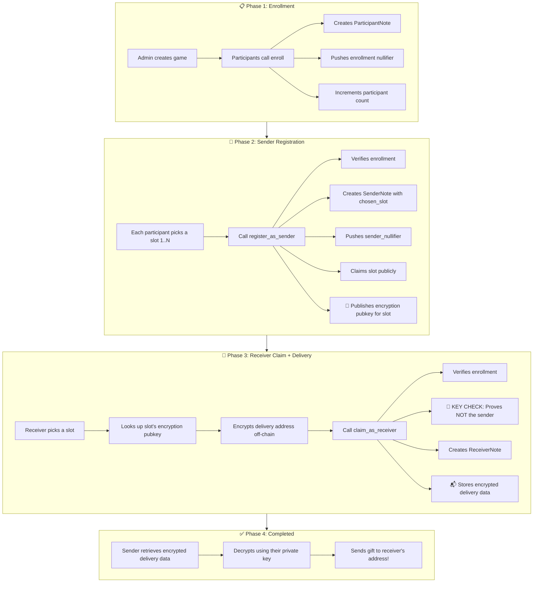
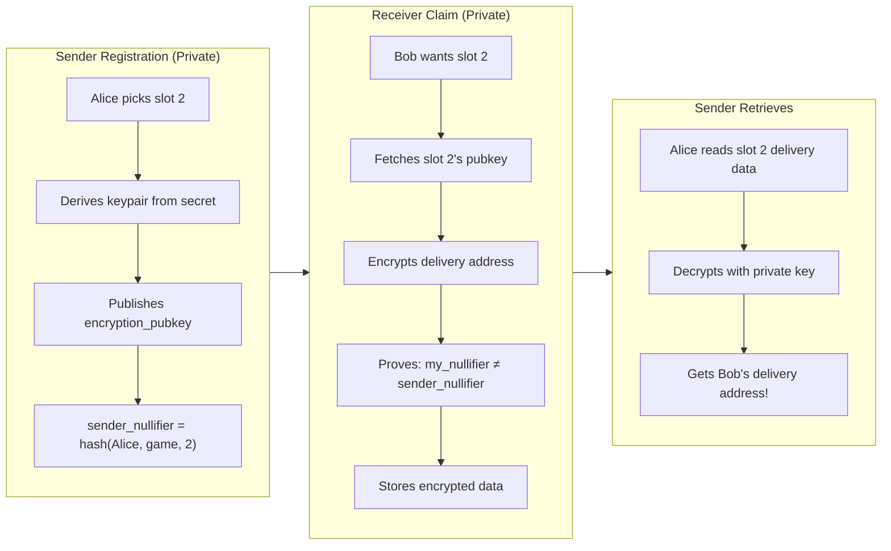
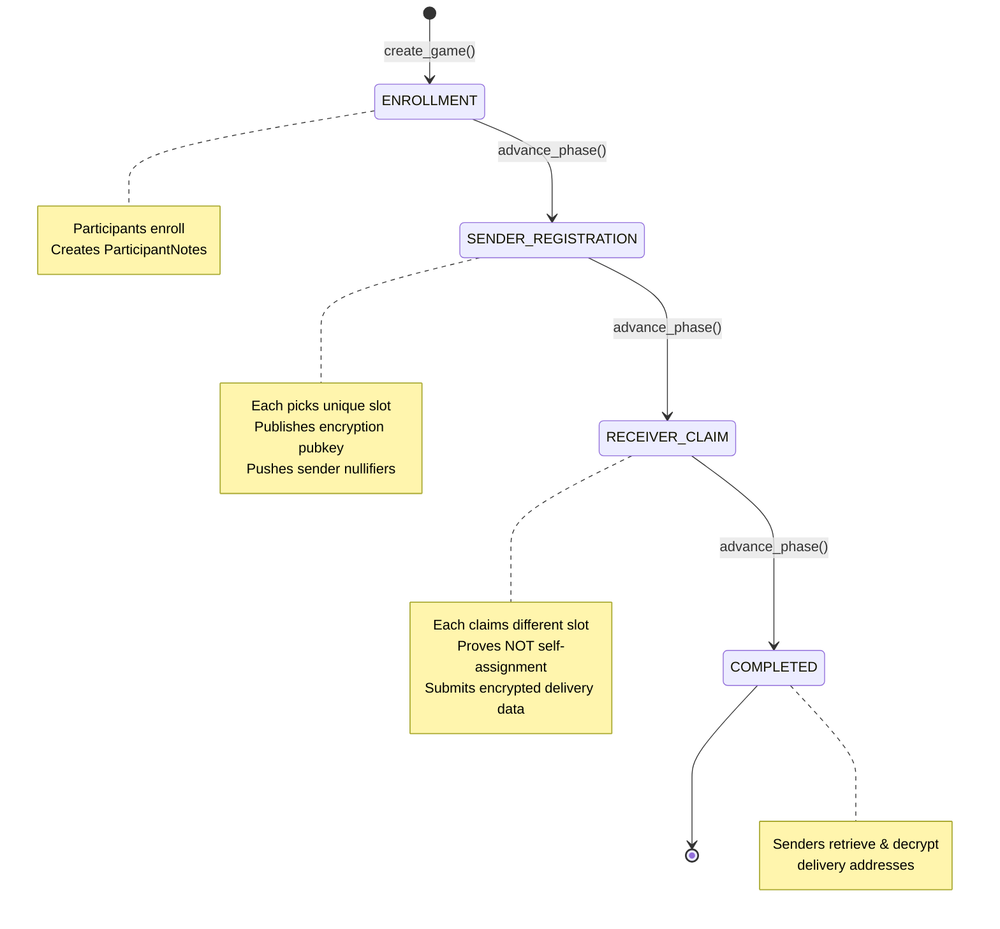

# ZK Secret Santa Protocol Flow

## The "Bag of Papers" Analogy

Imagine a physical Secret Santa ceremony with a bag of papers:

```
┌──────────────────────────────────────────────────────────────────────────────┐
│                         THE BAG OF PAPERS CEREMONY                           │
└──────────────────────────────────────────────────────────────────────────────┘

  STEP 1: ENROLLMENT - Get a paper
  ─────────────────────────────────

     "I want to play!"                     Everyone who wants to play
                                           gets a blank paper.
      👤 Alice ───┐
                  │      ┌───┐
      👤 Bob ─────┼───▶  │📄│  ← blank paper
                  │      └───┘
      👤 Carol ───┘


  STEP 2: WRITE YOUR MAILBOX - Behind a curtain
  ──────────────────────────────────────────────

     One by one, each person goes behind a CURTAIN.
     They write their "mailbox address" (public key) on their paper,
     then place it in ONE of the numbered slots on the wall.

         THE CURTAIN
              ║
              ║    ┌─────┬─────┬─────┐
              ║    │  1  │  2  │  3  │   ← numbered slots on the wall
              ║    ├─────┼─────┼─────┤
              ║    │     │     │     │
              ║    └─────┴─────┴─────┘
              ║

     Behind the curtain (PRIVATELY):
       • Alice writes pubkey_A, puts paper in slot 1
       • Bob writes pubkey_B, puts paper in slot 2
       • Carol writes pubkey_C, puts paper in slot 3

     What everyone can see (PUBLICLY):
       • Slot 1 has a paper with some pubkey
       • Slot 2 has a paper with some pubkey
       • Slot 3 has a paper with some pubkey

     What NO ONE knows:
       • WHO put their paper in which slot!
       • The curtain hides the person-to-slot mapping.


  STEP 3: CYCLIC ASSIGNMENT - Automatic slot assignment
  ─────────────────────────────────────────────────────

     Each person's receiver slot is AUTOMATICALLY assigned using
     cyclic permutation: receiver_slot = (your_slot % N) + 1

     This guarantees a valid cycle where no one picks themselves.

         Cyclic assignment (N=3):
           👤 Alice (slot 1) → assigned slot 2 → gets pubkey_B
           👤 Bob (slot 2)   → assigned slot 3 → gets pubkey_C
           👤 Carol (slot 3) → assigned slot 1 → gets pubkey_A

         The cycle is guaranteed: 1→2→3→1 (no deadlocks!)


  STEP 4: ENCRYPT YOUR ADDRESS
  ────────────────────────────

     You now have someone's "mailbox" (pubkey), but you don't know whose!
     You encrypt YOUR delivery address to that mailbox.
     Only the mailbox owner can open it.

         👤 Alice encrypts "123 Alice St" → to pubkey_B's mailbox
            (Only Bob can decrypt this, but Alice doesn't know it's Bob!)

         👤 Bob encrypts "456 Bob Ave" → to pubkey_C's mailbox
            (Only Carol can decrypt)

         👤 Carol encrypts "789 Carol Ln" → to pubkey_A's mailbox
            (Only Alice can decrypt)


  STEP 5: CHECK YOUR MAILBOX
  ──────────────────────────

     Each person checks the encrypted message left at THEIR slot.
     Only they can decrypt it (they have the private key).

         👤 Alice (owns slot 1) decrypts → "789 Carol Ln"
            → Ships gift to Carol!

         👤 Bob (owns slot 2) decrypts → "123 Alice St"
            → Ships gift to Alice!

         👤 Carol (owns slot 3) decrypts → "456 Bob Ave"
            → Ships gift to Bob!


┌──────────────────────────────────────────────────────────────────────────────┐
│                              THE RESULT                                      │
├──────────────────────────────────────────────────────────────────────────────┤
│                                                                              │
│     Alice → Carol       ✅ Everyone gives exactly ONE gift                   │
│     Bob → Alice         ✅ Everyone receives exactly ONE gift                │
│     Carol → Bob         ✅ Nobody knows who their Secret Santa is!           │
│                                                                              │
│     The CURTAIN (Aztec's private functions) is the magic.                   │
│     It hides WHO registered which slot.                                      │
│                                                                              │
└──────────────────────────────────────────────────────────────────────────────┘
```

### Physical vs Digital Mapping

| Physical World | Digital World (Contract) |
|----------------|--------------------------|
| Blank paper | Enrollment (join the game) |
| Numbered slots on wall | Slot numbers 1, 2, 3... N |
| Going behind curtain | Private function execution |
| Writing pubkey on paper | `register_as_sender(slot, pubkey)` |
| Putting paper in slot | Pubkey stored on-chain (slot → pubkey) |
| Curtain hides who | Aztec hides caller identity |
| Cyclic slot assignment | `claim_receiver()` with auto-assigned slot |
| No deadlocks possible | Cyclic permutation guarantees valid cycle |
| Encrypting to pubkey | ECIES encryption off-chain |
| Mailbox only you can open | Only slot owner has private key |

### The Key Insight

> **The privacy doesn't come from shuffling - there is no shuffle!**
>
> The privacy comes from the **curtain** (private function execution).
> Everyone can see WHAT is in each slot (the pubkey, the encrypted data),
> but nobody can see WHO put it there or WHO took from it.

---

## Overview Diagram



## The Core Privacy Mechanism



## Encryption Flow Detail

```
┌─────────────────────────────────────────────────────────────────┐
│  SENDER REGISTRATION                                             │
├─────────────────────────────────────────────────────────────────┤
│                                                                  │
│  Alice derives her keypair from her account secret:              │
│    private_key = deriveMasterIncomingViewingSecretKey(secret)   │
│    public_key = derivePublicKeyFromSecretKey(private_key)       │
│                  (i.e., private_key * G on Grumpkin curve)       │
│                                                                  │
│  Alice calls register_as_sender(game_id, slot=2, public_key)    │
│                                                                  │
│  PUBLIC STATE:                                                   │
│    slot_encryption_keys[game_id][2] = public_key                │
│    slot_claimed[game_id][2] = true                              │
│                                                                  │
│  PRIVATE (only Alice knows):                                     │
│    - She owns slot 2                                             │
│    - Her private_key                                             │
│                                                                  │
└─────────────────────────────────────────────────────────────────┘
                              ↓
┌─────────────────────────────────────────────────────────────────┐
│  RECEIVER CLAIM                                                  │
├─────────────────────────────────────────────────────────────────┤
│                                                                  │
│  Bob wants to receive from slot 2:                               │
│                                                                  │
│  1. Read public key:                                             │
│     pubkey = get_slot_encryption_key(game_id, 2)                │
│                                                                  │
│  2. Encrypt delivery address off-chain:                          │
│     encrypted = encrypt(pubkey, "123 Main St, City")            │
│                                                                  │
│  3. Call claim_as_receiver(game_id, slot=2, nullifier, encrypted)│
│     - Proves Bob ≠ sender of slot 2                              │
│     - Stores encrypted data publicly                             │
│                                                                  │
│  PUBLIC STATE:                                                   │
│    slot_delivery_data[game_id][2] = encrypted                   │
│                                                                  │
└─────────────────────────────────────────────────────────────────┘
                              ↓
┌─────────────────────────────────────────────────────────────────┐
│  SENDER RETRIEVES                                                │
├─────────────────────────────────────────────────────────────────┤
│                                                                  │
│  Alice (who owns slot 2) retrieves her receiver's info:          │
│                                                                  │
│  1. Read encrypted data:                                         │
│     encrypted = get_slot_delivery_data(game_id, 2)              │
│                                                                  │
│  2. Decrypt off-chain using her private key:                     │
│     address = decrypt(private_key, encrypted)                    │
│     → "123 Main St, City"                                        │
│                                                                  │
│  3. Alice ships the gift! 🎁                                     │
│                                                                  │
│  NO ONE ELSE can decrypt - only Alice has the private key!      │
│                                                                  │
└─────────────────────────────────────────────────────────────────┘
```

## Complete Example (3 Participants)

```
┌─────────────────────────────────────────────────────────────────┐
│                     ENROLLMENT PHASE                             │
├─────────────────────────────────────────────────────────────────┤
│  Alice enrolls → ParticipantNote(Alice, game_1)                 │
│  Bob enrolls   → ParticipantNote(Bob, game_1)                   │
│  Carol enrolls → ParticipantNote(Carol, game_1)                 │
│                                                                  │
│  Participant count: 3                                            │
└─────────────────────────────────────────────────────────────────┘
                              ↓
┌─────────────────────────────────────────────────────────────────┐
│                  SENDER REGISTRATION PHASE                       │
├─────────────────────────────────────────────────────────────────┤
│  Alice: slot 1, pubkey_A → nullifier_1 = hash(Alice, 1, 1)      │
│  Bob:   slot 2, pubkey_B → nullifier_2 = hash(Bob, 1, 2)        │
│  Carol: slot 3, pubkey_C → nullifier_3 = hash(Carol, 1, 3)      │
│                                                                  │
│  PUBLIC STATE:                                                   │
│    slot_encryption_keys[1] = pubkey_A  (whose? unknown)         │
│    slot_encryption_keys[2] = pubkey_B  (whose? unknown)         │
│    slot_encryption_keys[3] = pubkey_C  (whose? unknown)         │
└─────────────────────────────────────────────────────────────────┘
                              ↓
┌─────────────────────────────────────────────────────────────────┐
│                   RECEIVER CLAIM PHASE                           │
├─────────────────────────────────────────────────────────────────┤
│  Alice claims slot 2:                                            │
│    - Proves hash(Alice, 1, 2) ≠ nullifier_2 ✓                   │
│    - Encrypts her address with pubkey_B                          │
│    - Stores encrypted data at slot 2                             │
│                                                                  │
│  Bob claims slot 3:                                              │
│    - Proves hash(Bob, 1, 3) ≠ nullifier_3 ✓                     │
│    - Encrypts his address with pubkey_C                          │
│    - Stores encrypted data at slot 3                             │
│                                                                  │
│  Carol claims slot 1:                                            │
│    - Proves hash(Carol, 1, 1) ≠ nullifier_1 ✓                   │
│    - Encrypts her address with pubkey_A                          │
│    - Stores encrypted data at slot 1                             │
└─────────────────────────────────────────────────────────────────┘
                              ↓
┌─────────────────────────────────────────────────────────────────┐
│                      GIFT DELIVERY                               │
├─────────────────────────────────────────────────────────────────┤
│                                                                  │
│  Alice (owns slot 1):                                            │
│    - Reads slot 1 delivery data                                  │
│    - Decrypts with her private key                               │
│    - Gets Carol's address → Ships gift to Carol                  │
│                                                                  │
│  Bob (owns slot 2):                                              │
│    - Reads slot 2 delivery data                                  │
│    - Decrypts with his private key                               │
│    - Gets Alice's address → Ships gift to Alice                  │
│                                                                  │
│  Carol (owns slot 3):                                            │
│    - Reads slot 3 delivery data                                  │
│    - Decrypts with her private key                               │
│    - Gets Bob's address → Ships gift to Bob                      │
│                                                                  │
│  Result: Alice→Carol, Bob→Alice, Carol→Bob 🎁                   │
└─────────────────────────────────────────────────────────────────┘
```

## State Transitions



## Contract Functions

| Function | Phase | Privacy | Description |
|----------|-------|---------|-------------|
| `create_game` | - | Public | Creates a new game |
| `enroll` | 1 | Private | Join game, get ParticipantNote |
| `register_as_sender` | 2 | Private | Claim slot, publish encryption key |
| `claim_receiver` | 3 | Private | Claim with auto-assigned slot (cyclic) |
| `get_slot_encryption_key` | 3 | View | Get pubkey to encrypt delivery data |
| `get_slot_delivery_data` | 4 | View | Get encrypted delivery data to decrypt |

## Privacy Guarantees

| Information | Visibility |
|-------------|------------|
| Game exists | Public |
| Number of participants | Public |
| Which slots are claimed | Public |
| Encryption pubkeys per slot | Public |
| Encrypted delivery data | Public |
| WHO owns which slot | **Private** |
| Sender-receiver pairings | **Private** |
| Decrypted delivery addresses | **Private** (only sender) |

## Key Security Property

The ZK proof ensures:
```
∀ receiver R, slot S:
  R.claims(S) ⟹ R ≠ sender(S)
```

Without revealing WHO the sender is.

The encryption ensures:
```
∀ slot S:
  only sender(S) can decrypt delivery_data(S)
```

Without revealing sender(S)'s identity.

---

## Security Notes & Paper Deviations

This implementation is based on arXiv:2501.06515v1 ("ZK Secret Santa") with adaptations for Aztec.

### Self-Selection Prevention

**Paper**: Uses ZK constraint `null_r ≠ null_s` proven inside the circuit.

**Implementation**: Prevented by construction via cyclic permutation:
- Receiver slot is auto-calculated: `(sender_slot % participant_count) + 1`
- If you're slot N, you automatically receive from slot (N % count) + 1
- This is mathematically guaranteed to be a different slot
- No nullifier collision detection needed for self-selection
- Receiver nullifier still used to prevent double claiming

### Nullifier Scheme

**Paper**: Uses `hash(sig.s)` derived from deterministic ECDSA signatures (RFC 6979).

**Implementation**: Uses `poseidon2_hash([address, game_id, slot], domain)`:
- Simpler and native to Aztec
- Equally secure given Aztec's account authentication model
- No need for external ECDSA in circuit

### Signature Commitment Phase

**Paper**: Requires explicit `hash(ECDSA_signature)` commitment before any action.

**Implementation**: Omitted because:
- Aztec accounts ARE cryptographically bound to keys (Schnorr signatures)
- Enrollment nullifier prevents double-enrollment
- Game ID in nullifiers prevents cross-game replay

### Permutation Guarantee

**Paper**: Uses randomness with anchor constraints to create implicit derangement.

**Implementation**: Cyclic permutation with deterministic assignment:
- Receiver slot is auto-calculated: `(sender_slot % participant_count) + 1`
- Forms a single cycle: 1→2→3→...→N→1
- Self-selection is impossible by construction (no nullifier trick needed)
- No deadlocks possible - everyone is guaranteed a valid assignment
- Phase cannot advance to COMPLETED unless all participants have claimed

### Encryption

**Paper**: RSA-2048 with exp=65537.

**Implementation**: ECIES over Grumpkin curve with AES-128-CBC:
- More efficient for blockchain (smaller keys)
- Supports up to 111 bytes of delivery data
- Uses Aztec's native curve

### Privacy Model

**Paper**: Relies on transaction relayer to hide sender-randomness correlation.

**Implementation**: Uses Aztec's native privacy:
- Private functions execute in local PXE
- No trusted relayer required
- Cryptographic privacy, not trust-based

---

## Changelog

### v3 (Cyclic Permutation)
- **Deadlock Fix**: Replaced free slot selection with cyclic permutation
- Receiver slot is now auto-calculated: `(sender_slot % participant_count) + 1`
- Self-selection prevented by construction (not nullifier collision)
- Guarantees valid derangement for any number of participants
- `claim_as_receiver(slot)` renamed to `claim_receiver()` (no slot parameter)

### v2 (Paper Deviation Fixes)
- **Issue 1**: Replaced unconstrained oracle with nullifier collision detection
- **Issue 3**: Added receiver claim tracking and phase validation
- **Issue 5**: Increased encrypted payload from 4 fields (47 bytes) to 8 fields (111 bytes)

See `docs/paper-comparison.md` for detailed analysis.
