# ZK Secret Santa Protocol Flow

## Overview Diagram


## The Core Privacy Mechanism

```mermaid
flowchart LR
    subgraph SenderReg["Sender Registration (Private)"]
        S1["Alice picks slot 2"] --> S2["Derives keypair from secret"]
        S2 --> S3["Publishes encryption_pubkey"]
        S3 --> S4["sender_nullifier = hash(Alice, game, 2)"]
    end

    subgraph ReceiverClaim["Receiver Claim (Private)"]
        R1["Bob wants slot 2"] --> R2["Fetches slot 2's pubkey"]
        R2 --> R3["Encrypts delivery address"]
        R3 --> R4["Proves: my_nullifier ≠ sender_nullifier"]
        R4 --> R5["Stores encrypted data"]
    end

    subgraph SenderRetrieve["Sender Retrieves"]
        T1["Alice reads slot 2 delivery data"] --> T2["Decrypts with private key"]
        T2 --> T3["Gets Bob's delivery address!"]
    end

    SenderReg --> ReceiverClaim
    ReceiverClaim --> SenderRetrieve
```



## Encryption Flow Detail

```
┌─────────────────────────────────────────────────────────────────┐
│  SENDER REGISTRATION                                             │
├─────────────────────────────────────────────────────────────────┤
│                                                                  │
│  Alice derives her keypair from her account secret:              │
│    private_key = deriveMasterIncomingViewingSecretKey(secret)   │
│    public_key = derivePublicKeyFromSecretKey(private_key)       │
│                  (i.e., private_key * G on Grumpkin curve)       │
│                                                                  │
│  Alice calls register_as_sender(game_id, slot=2, public_key)    │
│                                                                  │
│  PUBLIC STATE:                                                   │
│    slot_encryption_keys[game_id][2] = public_key                │
│    slot_claimed[game_id][2] = true                              │
│                                                                  │
│  PRIVATE (only Alice knows):                                     │
│    - She owns slot 2                                             │
│    - Her private_key                                             │
│                                                                  │
└─────────────────────────────────────────────────────────────────┘
                              ↓
┌─────────────────────────────────────────────────────────────────┐
│  RECEIVER CLAIM                                                  │
├─────────────────────────────────────────────────────────────────┤
│                                                                  │
│  Bob wants to receive from slot 2:                               │
│                                                                  │
│  1. Read public key:                                             │
│     pubkey = get_slot_encryption_key(game_id, 2)                │
│                                                                  │
│  2. Encrypt delivery address off-chain:                          │
│     encrypted = encrypt(pubkey, "123 Main St, City")            │
│                                                                  │
│  3. Call claim_as_receiver(game_id, slot=2, nullifier, encrypted)│
│     - Proves Bob ≠ sender of slot 2                              │
│     - Stores encrypted data publicly                             │
│                                                                  │
│  PUBLIC STATE:                                                   │
│    slot_delivery_data[game_id][2] = encrypted                   │
│                                                                  │
└─────────────────────────────────────────────────────────────────┘
                              ↓
┌─────────────────────────────────────────────────────────────────┐
│  SENDER RETRIEVES                                                │
├─────────────────────────────────────────────────────────────────┤
│                                                                  │
│  Alice (who owns slot 2) retrieves her receiver's info:          │
│                                                                  │
│  1. Read encrypted data:                                         │
│     encrypted = get_slot_delivery_data(game_id, 2)              │
│                                                                  │
│  2. Decrypt off-chain using her private key:                     │
│     address = decrypt(private_key, encrypted)                    │
│     → "123 Main St, City"                                        │
│                                                                  │
│  3. Alice ships the gift! 🎁                                     │
│                                                                  │
│  NO ONE ELSE can decrypt - only Alice has the private key!      │
│                                                                  │
└─────────────────────────────────────────────────────────────────┘
```

## Complete Example (3 Participants)

```
┌─────────────────────────────────────────────────────────────────┐
│                     ENROLLMENT PHASE                             │
├─────────────────────────────────────────────────────────────────┤
│  Alice enrolls → ParticipantNote(Alice, game_1)                 │
│  Bob enrolls   → ParticipantNote(Bob, game_1)                   │
│  Carol enrolls → ParticipantNote(Carol, game_1)                 │
│                                                                  │
│  Participant count: 3                                            │
└─────────────────────────────────────────────────────────────────┘
                              ↓
┌─────────────────────────────────────────────────────────────────┐
│                  SENDER REGISTRATION PHASE                       │
├─────────────────────────────────────────────────────────────────┤
│  Alice: slot 1, pubkey_A → nullifier_1 = hash(Alice, 1, 1)      │
│  Bob:   slot 2, pubkey_B → nullifier_2 = hash(Bob, 1, 2)        │
│  Carol: slot 3, pubkey_C → nullifier_3 = hash(Carol, 1, 3)      │
│                                                                  │
│  PUBLIC STATE:                                                   │
│    slot_encryption_keys[1] = pubkey_A  (whose? unknown)         │
│    slot_encryption_keys[2] = pubkey_B  (whose? unknown)         │
│    slot_encryption_keys[3] = pubkey_C  (whose? unknown)         │
└─────────────────────────────────────────────────────────────────┘
                              ↓
┌─────────────────────────────────────────────────────────────────┐
│                   RECEIVER CLAIM PHASE                           │
├─────────────────────────────────────────────────────────────────┤
│  Alice claims slot 2:                                            │
│    - Proves hash(Alice, 1, 2) ≠ nullifier_2 ✓                   │
│    - Encrypts her address with pubkey_B                          │
│    - Stores encrypted data at slot 2                             │
│                                                                  │
│  Bob claims slot 3:                                              │
│    - Proves hash(Bob, 1, 3) ≠ nullifier_3 ✓                     │
│    - Encrypts his address with pubkey_C                          │
│    - Stores encrypted data at slot 3                             │
│                                                                  │
│  Carol claims slot 1:                                            │
│    - Proves hash(Carol, 1, 1) ≠ nullifier_1 ✓                   │
│    - Encrypts her address with pubkey_A                          │
│    - Stores encrypted data at slot 1                             │
└─────────────────────────────────────────────────────────────────┘
                              ↓
┌─────────────────────────────────────────────────────────────────┐
│                      GIFT DELIVERY                               │
├─────────────────────────────────────────────────────────────────┤
│                                                                  │
│  Alice (owns slot 1):                                            │
│    - Reads slot 1 delivery data                                  │
│    - Decrypts with her private key                               │
│    - Gets Carol's address → Ships gift to Carol                  │
│                                                                  │
│  Bob (owns slot 2):                                              │
│    - Reads slot 2 delivery data                                  │
│    - Decrypts with his private key                               │
│    - Gets Alice's address → Ships gift to Alice                  │
│                                                                  │
│  Carol (owns slot 3):                                            │
│    - Reads slot 3 delivery data                                  │
│    - Decrypts with her private key                               │
│    - Gets Bob's address → Ships gift to Bob                      │
│                                                                  │
│  Result: Alice→Carol, Bob→Alice, Carol→Bob 🎁                   │
└─────────────────────────────────────────────────────────────────┘
```

## State Transitions


## Contract Functions

| Function | Phase | Privacy | Description |
|----------|-------|---------|-------------|
| `create_game` | - | Public | Creates a new game |
| `enroll` | 1 | Private | Join game, get ParticipantNote |
| `register_as_sender` | 2 | Private | Claim slot, publish encryption key |
| `claim_as_receiver` | 3 | Private | Claim sender, submit encrypted delivery |
| `get_slot_encryption_key` | 3 | View | Get pubkey to encrypt delivery data |
| `get_slot_delivery_data` | 4 | View | Get encrypted delivery data to decrypt |

## Privacy Guarantees

| Information | Visibility |
|-------------|------------|
| Game exists | Public |
| Number of participants | Public |
| Which slots are claimed | Public |
| Encryption pubkeys per slot | Public |
| Encrypted delivery data | Public |
| WHO owns which slot | **Private** |
| Sender-receiver pairings | **Private** |
| Decrypted delivery addresses | **Private** (only sender) |

## Key Security Property

The ZK proof ensures:
```
∀ receiver R, slot S:
  R.claims(S) ⟹ R ≠ sender(S)
```

Without revealing WHO the sender is.

The encryption ensures:
```
∀ slot S:
  only sender(S) can decrypt delivery_data(S)
```

Without revealing sender(S)'s identity.
